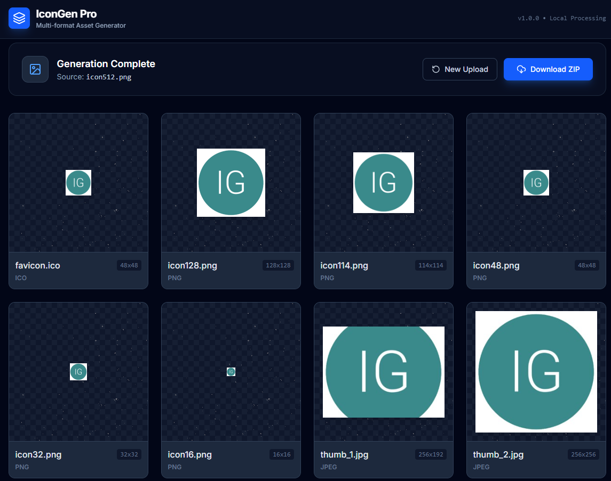

# IconGen Pro
Multi-format Asset Generator

Given an image with size 256x256, 512x512, 1024x1024, auto generate following image locally

| filename | size  | desc |
| -------- | ----- | ----  |
| favicon.ico | 48x48 | used for web site |
| icon128.png | 128x128 | chrome extension |
| icon114.png | 114x114 | chrome extension or amazon store |
| icon48.png | 48x48 |  chrome extension |
| icon32.png | 32x32 | chrome extension |
| icon16.png | 16x16 | chrome extension |
| thumb_1.jpg | 256x192 | [free online h5 web game](https://www.arcadeh5.com) |
| thumb_2.jpg | 256x256 | [free online html5 web game](https://www.arcadeh5.com) |

## TODO NEXT
- compress images as less as possible
- more image export support: webp, tif, and so on
- cutomzie crop image online, too compliate may be!